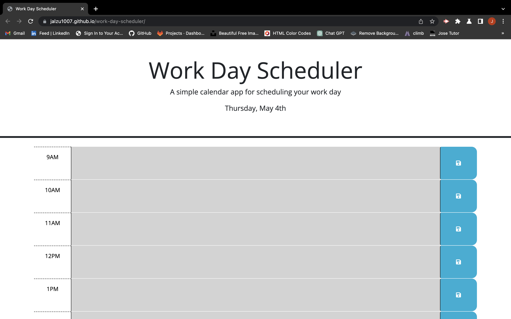
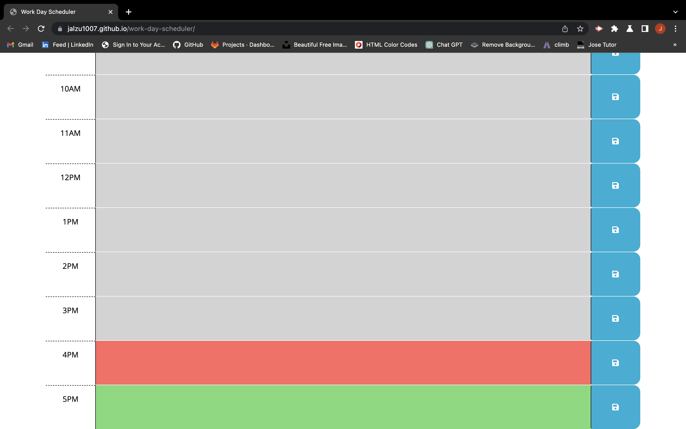

# work-day-scheduler

## Description
The Work Day Scheduler is a simple calendar application that allows a user to save events for each hour of the day. The application runs in the browser and features dynamically updated HTML and CSS powered by jQuery. It uses the Day.js library to work with date and time.

The motivation behind this project was to create a useful tool for employees with busy schedules to manage their time effectively. It provides a simple and easy-to-use interface to schedule important events throughout the day.

The Work Day Scheduler provides a visual representation of the user's day and allows them to easily add and edit events in a timely manner. It helps the user to keep track of their schedule and plan their workday more efficiently.

Through this project, I learned how to use jQuery to dynamically update HTML and CSS based on user interaction. I also learned how to work with date and time using the Day.js library.

## Installation

To install this project, follow these steps:

1. Clone the repository on your local machine using the following command:

git clone https://github.com/Jalzu1007/work-day-scheduler.git

2. Navigate to the repository's directory using the command:

 cd work-day-scheduler

3. Open the index.html file in your web browser to view the webpage.

## Usage

To use the Work Day Scheduler, follow these steps:

1. Open the application in your web browser.
2. The current day will be displayed at the top of the calendar.
3. Scroll down to view the timeblocks for standard business hours.
4. Each timeblock is color-coded to indicate whether it is in the past, present, or future.
5. Click into a timeblock to enter an event.
6. Click the save button for that timeblock to save the event text in local storage.
7. If you refresh the page, the saved events will persist.

Deployed website:

https://jalzu1007.github.io/work-day-scheduler/

Screenshot of the Work Day Scheduler:

   

## Credits

I used the following third-party assets in this project:

- https://youtu.be/Oive66jrwBs
- https://youtu.be/QpepYlxPJkQ
- https://youtu.be/eow125xV5-c
- https://youtu.be/vmXIGdP8KN8
- https://youtu.be/qgmLDPLApBY
- https://youtu.be/Jyvffr3aCp0

## License

N/A